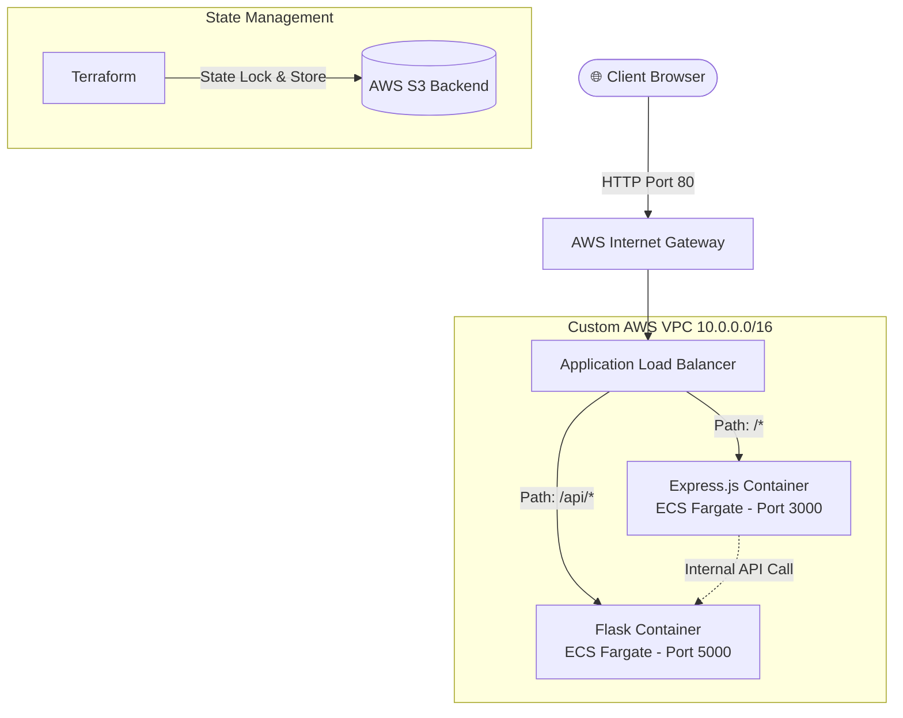

# 🚀 AWS Infrastructure Evolution: Monolithic to Containerized Microservices

**Author:** Vamsi Krishna Adusumalli


## 📖 Overview
This repository contains an end-to-end DevOps implementation demonstrating the architectural evolution of a multi-tier web application (Express.js Frontend, Flask Backend) on Amazon Web Services (AWS). 

Using Terraform for Infrastructure as Code (IaC), the deployment progresses through three distinct phases: a single-server monolith, a decoupled multi-server architecture, and a production-grade containerized deployment using AWS ECS Fargate and an Application Load Balancer (ALB).

---

## 🏗️ Final Architecture (Phase 3)

*GitHub automatically renders this flowchart to visualize the final containerized networking routing.*



---

## 🛤️ Architectural Evolution

* **Phase 1: Monolithic Deployment** 📦
Bootstrapped both the Express frontend and Flask backend onto a single EC2 instance using Terraform `user_data`. Services communicated internally over the loopback interface (`localhost`).
* **Phase 2: Decoupled Architecture** 🔀
Separated the frontend and backend onto dedicated, isolated EC2 instances. Introduced cross-server communication over the public internet utilizing dynamic environment variable injection (`BACKEND_URL`).
* **Phase 3: Containerized Microservices (Production-Grade)** 🐳
A highly available, containerized architecture utilizing custom networking and serverless compute.
* **Custom VPC:** Built with multiple public subnets across distinct Availability Zones.
* **AWS ECR:** Docker images stored in private Elastic Container Registries.
* **AWS ECS (Fargate):** Applications deployed as serverless containers.
* **AWS ALB:** Application Load Balancer acts as the single entry point, using path-based routing to direct traffic.


---

## ⚙️ Execution Guide

### 1️⃣ Remote State Initialization

AWS S3 is utilized to store the Terraform state file remotely, ensuring state locking and consistency.

```bash
aws s3api create-bucket --bucket <bucket-name> --region ap-south-1 --create-bucket-configuration LocationConstraint=ap-south-1
terraform init

```

### 2️⃣ Infrastructure Provisioning

Standard Terraform workflow used across all three deployment phases.

```bash
terraform validate               # Validate syntax
terraform plan                   # Review the execution plan
terraform apply --auto-approve   # Provision the infrastructure
terraform destroy --auto-approve # Safely tear down resources

```

### 3️⃣ Containerization & ECR Image Management

Building and publishing immutable Docker artifacts to AWS ECR.

```bash
# Authenticate local Docker daemon with AWS ECR
aws ecr get-login-password --region ap-south-1 | docker login --username AWS --password-stdin <aws-account-id>.dkr.ecr.ap-south-1.amazonaws.com

# Build & Push Backend
docker build -t flask-backend-repo ./backend
docker tag flask-backend-repo:latest <aws-account-id>[.dkr.ecr.ap-south-1.amazonaws.com/flask-backend-repo:latest](https://.dkr.ecr.ap-south-1.amazonaws.com/flask-backend-repo:latest)
docker push <aws-account-id>[.dkr.ecr.ap-south-1.amazonaws.com/flask-backend-repo:latest](https://.dkr.ecr.ap-south-1.amazonaws.com/flask-backend-repo:latest)

```

---

## 🧠 Key Technical Learnings

* 🔐 **Remote State Management:** Utilizing AWS S3 as a remote backend decouples state files from the local environment, protecting critical infrastructure data.
* ⚖️ **Architectural Decoupling:** Separating components across independent instances highlighted the importance of strict Security Group ingress rules and dynamic IP management.
* ☁️ **Serverless Orchestration:** Migrating to Docker containers on AWS ECS Fargate abstracts underlying server maintenance, allowing deployments to focus strictly on resource allocation.
* 🌐 **Advanced Cloud Networking:** Building a custom VPC reinforced core networking principles. Configuring Internet Gateways, Route Tables, and multi-AZ Subnets is critical for AWS Application Load Balancer high availability.
* 🚦 **Traffic Routing:** Implementing path-based routing rules on an ALB demonstrates how a single public DNS endpoint can seamlessly route traffic to multiple isolated microservices.
